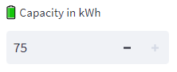
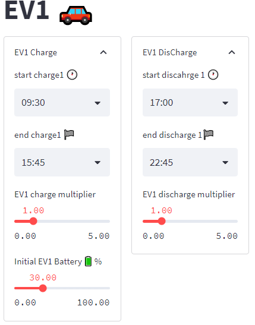

# Daily Ev Planner

The 'Daily Ev Planner' is a software tool that allows users to manage the charging and discharging behavior of up to four electric vehicles (EVs) in a streamlined and user-friendly way. With features such as a plot tool, daily power exchange analysis, and battery view, users can easily visualize and analyze the performance of their EVs over time. The tool is designed to help users optimize system performance and efficiency by providing a comprehensive view of the charging and discharging behavior of their EVs.


## Table of Contents

- [Installation](#installation)
- [Usage](#usage)
- [Features](#features)
- [Contributing](#contributing)
- [Credits](#credits)
- [License](#license)

## Installation

1. Clone the repository to your local machine using the following command:
    
    ```bash
    git clone https://github.com/SteDiamant/streamlitProject
    ```
    
2. Navigate to the project directory:
    
    ```bash
    cd streamlitProject
    ```
    
3. Install the required Python packages using pip:
    
    ```python
    pip install -r requirements.txt
    ```
    
4. Run the application using Streamlit:
    
    ```python
    streamlit run app.py
    ```

## Usage
 
To use the EV Charging and Discharging Controller, you have two options:

1. Clone the repository and install the application on your local machine. Follow the installation instructions to run the app on your local network.
2. Access the online version hosted on Streamlit Cloud by going to the following link: <br> 
https://stediamant-streamlitproject-home-fhhcal.streamlit.app/DailyEVPlanner


## Features
### Day Choice
Daily data with 15-minute intervals were created by dividing the original yearly dataset into equal chunks of 96, representing daily data with 15-minute intervals.

  


### Maximum Battery Capacity Controler

This variable controls the Maximum Capacity of all batteries.

 

### EV Charging and Discharging Controller
The "EV Charging and Discharging Controller" feature allows users to define the charging and discharging behavior of up to four electric vehicles (EVs) within a Streamlit application. The feature is implemented using Streamlit's st.form() function to create a user interface that can be easily filled out by the user.



Within each of the four columns, the user can expand an "EV Charge" and "EV Discharge" section. Within these sections, the user can specify the start and end times for charging and discharging, battery levels, and charge and discharge multipliers.


This feature provides users with a simple and intuitive way to input and define the charging and discharging behavior of multiple EVs within their Streamlit application. The input parameters collected through this feature can then be used for further analysis or processing within the application.

### Plot Tool
The "Plot Tool" feature provides users with a convenient and efficient way to visualize the charging and discharging behavior of up to four different electric vehicles (EVs) in the system. By displaying the charging and discharging behavior of each EV over time, users can easily identify any potential issues or imbalances that may arise in the system.


Additionally, the plot includes information such as the `PV (W)` output, `Imbalance (W)`, and `Total_Imbalance (W)`, allowing users to gain a comprehensive understanding of the system's overall performance.
<div class="warning" style="width: 100%;">

$${TotalDemand (W)} = {General Demand (W)} + {Heating Demand (W)}$$

$${Imbalance (W)} = {TotalDemand (W)} + {PV (W)}*NumberPV$$

$${TotalEVCharge (W)}={\sum_{i=1}^4 TotalEVCharge_i (W)} $$

$${TotalEVDisCharge (W)}={\sum_{i=1}^4 TotalEVDisCharge_i (W)}  $$

$${TotalImbalance (W)} = {Imbalance (W)} + {TotalEVCharge (W)} + {Total EVDisCharge (W)}$$

</div>
The multiselect dropdown menu enables users to select the EVs they wish to view on the plot, providing a customizable and user-friendly experience. By allowing users to select specific EVs, they can focus on the vehicles that are most relevant to them, saving time and improving productivity.

Overall, the "Plot Tool" feature provides users with a powerful tool to visualize and analyze the performance of the EV charging and discharging system, helping to ensure optimal system performance and efficiency.


## Daily Power Exhcange Analysis
The 'Daily Power Exhcange Analysis' feature provides a user-friendly and interactive plot tool for visualizing the charging and discharging behavior of up to four different electric vehicles (EVs). The tool is contained in a container object and divided into three columns, each displaying a different type of plot.

The first column shows a bar plot that displays the total energy exchange for each individual EV, with the charging values represented in blue and the discharging values in red. The x-axis labels are customizable and the energy values for each car are displayed on the plot.


The second column displays another bar plot that shows the total energy exchange for all EVs combined. The energy values for total discharge and total charge are displayed and can be customized.


The third column contains a pie chart that shows the proportion of energy coming from photovoltaics (PVs) and from the grid. This provides a quick and easy way to see the source of energy for the EVs.


The energy source logic is based on the following equations:

- If EV_charge > 0 and TotalImbalance < 0, then there is extra energy produced by the PVs and moved to the EVs:

    PVs --> EVs

- If EV_charge > 0 and TotalImbalance > 0, then the energy is coming from the grid:

    Grid --> EVs

The above equations determine the energy flow direction based on the state of charge of the EVs and the total energy imbalance in the system. The code uses these equations to calculate the energy source and classify it as either from the PVs or from the grid, which is then used to generate a pie chart showing the proportion of energy from each source. 


Overall, this tool is a useful and intuitive way to visualize the energy exchange for multiple EVs and can be easily customized to display different data.
### Battery View
The 'BatteryView' creates 4 expanders that display the battery level of 4 different electric vehicles (EVs) and a graph of their battery level over time. 


Each expander consists of two columns, where the left column shows the starting and ending battery level of the charging session for the corresponding EV, while the right column displays a graph of the battery level over time.


The pie chart that shows the proportion of energy coming from photovoltaics (PVs) and from the grid.

The graph has two areas: one area represents the energy charged from green sources, while the other represents energy charged from non-green sources. 

There are blue horizontal lines on the graph that indicate the battery capacity levels of the EV (20%, 80%, and 100%), and a red horizontal line indicating the maximum battery capacity of the EV. 


## Credits
This modelling tool was developed by Stelios Diamantopoulos for the purpose of Microgrid Modeling for Saxion University Of Applied Science Sustainability lab. The project was supervised by Professor `Rita Garcia Peran` Energy Engineer.

The following individuals also contributed to the development of the tool:


`Edmund Schaefer`, Senior Lecturer/Researcher at Saxion Univrsity Of Applied Science .
\
`Viktor Nikolayev`, Electrical and Electronic Engineering / Software Development / Geographical Information Systems .

Who assisted with data collection, analysis and provided feedback for the development process.

I would like to thank everyone who contributed to this project and made it possible. This tool is released under the Apache License, Version 2.0, and we encourage others to build upon our work and continue to advance the field of microgrid modeling.

## Future Work

- Creating a database: 

    Currently, the tool reads data from CSV files, which can be time-consuming and may not scale well for larger datasets. In the future, it would be beneficial to integrate the tool with a database such as MongoDB or Snowflake to allow for faster and more efficient data storage and retrieval.

- Battery limitations:

     The current version of the tool generates charge and discharge profiles without taking into account the maximum capacity of the battery. In future versions, we could consider incorporating this limitation into the model.
     - One approach would be to generate profiles that are within the battery capacity limits, by adjusting the generation algorithm to take the maximum capacity into account.
     - Alternatively, create a function that corrects the generated profiles to ensure they are within the capacity limits (0, MAXIMUM_CAR_CAPACITY).
     
- Between charge and discharge timestamps the car has to drive certain amount of km in order to reach destination . For every car a slider can be created that will determine the travel distance between charge and discharge in km and will reduce battery capacity accordingly.
- Better Functions for plotting maybe create a Plotter class instead of generating the plots into the main function
## License

This project is licensed under the Apache License, Version 2.0 (the "License"); you may not use this file except in compliance with the License. You may obtain a copy of the License at:

    http://www.apache.org/licenses/LICENSE-2.0

Unless required by applicable law or agreed to in writing, software distributed under the License is distributed on an "AS IS" BASIS, WITHOUT WARRANTIES OR CONDITIONS OF ANY KIND, either express or implied. See the License for the specific language governing permissions and limitations under the License.

