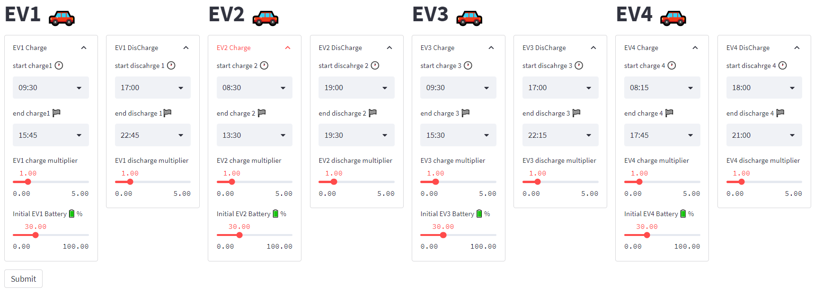

# Project Name

Include the name of your project and a brief description of what it does.

## Table of Contents

- [Installation](#installation)
- [Usage](#usage)
- [Features](#features)
- [Contributing](#contributing)
- [Credits](#credits)
- [License](#license)

## Installation

Include instructions on how to install your project. This could be a list of command-line instructions or a link to a package manager like npm or pip.

## Usage

Include instructions on how to use your project. This could be a list of command-line instructions or a description of how to use a user interface.

## Features

### EV Charging and Discharging Controller
The "EV Charging and Discharging Controller" feature allows users to define the charging and discharging behavior of up to four electric vehicles (EVs) within a Streamlit application. The feature is implemented using Streamlit's st.form() function to create a user interface that can be easily filled out by the user.

Within each of the four columns, the user can expand an "EV Charge" and "EV Discharge" section. Within these sections, the user can specify the start and end times for charging and discharging, battery levels, and charge and discharge multipliers.

This feature provides users with a simple and intuitive way to input and define the charging and discharging behavior of multiple EVs within their Streamlit application. The input parameters collected through this feature can then be used for further analysis or processing within the application.

### Plot Tool
The "Plot Tool" feature provides users with a convenient and efficient way to visualize the charging and discharging behavior of up to four different electric vehicles (EVs) in the system. By displaying the charging and discharging behavior of each EV over time, users can easily identify any potential issues or imbalances that may arise in the system.

Additionally, the plot includes information such as the `PV (W)` output, `Imbalance (W)`, and `Total_Imbalance (W)`, allowing users to gain a comprehensive understanding of the system's overall performance.
$$\text{TotalDemand (W)} = \text{General Demand (W)} + \text{Heating Demand (W)}$$

$$\text{Imbalance (W)} = \text{TotalDemand (W)} + \text{PV (W)}*Number\_PVs$$

$$\text{Total\_EV\_Charge (W)}={Total\_EV\_Charge\_1 (W)} + {Total\_EV\_Charge\_2 (W)} +{Total\_EV\_Charge\_3 (W)}+{Total\_EV\_Charge\_4 (W)}  $$
$$\text{Total\_EV\_DisCharge (W)}={Total\_EV\_DisCharge\_1 (W)} + {Total\_EV\_DisCharge\_2 (W)} +{Total\_EV\_DisCharge\_3 (W)}+{Total\_EV\_DisCharge\_4 (W)}  $$

$$\text{Total\_Imbalance (W)} = \text{Imbalance (W)} + \text{Total\_EV\_Charge (W)} + \text{Total\_EV\_DisCharge (W)}$$

The multiselect dropdown menu enables users to select the EVs they wish to view on the plot, providing a customizable and user-friendly experience. By allowing users to select specific EVs, they can focus on the vehicles that are most relevant to them, saving time and improving productivity.

Overall, the "Plot Tool" feature provides users with a powerful tool to visualize and analyze the performance of the EV charging and discharging system, helping to ensure optimal system performance and efficiency.

## Daily Power Exhcange Analysis
The 'Daily Power Exhcange Analysis' feature provides a user-friendly and interactive plot tool for visualizing the charging and discharging behavior of up to four different electric vehicles (EVs). The tool is contained in a container object and divided into three columns, each displaying a different type of plot.

The first column shows a bar plot that displays the total energy exchange for each individual EV, with the charging values represented in blue and the discharging values in red. The x-axis labels are customizable and the energy values for each car are displayed on the plot.

The second column displays another bar plot that shows the total energy exchange for all EVs combined. The energy values for total discharge and total charge are displayed and can be customized.

The third column contains a pie chart that shows the proportion of energy coming from photovoltaics (PVs) and from the grid. This provides a quick and easy way to see the source of energy for the EVs.

The energy source logic is based on the following equations:

- If EV_charge > 0 and TotalImbalance < 0, then there is extra energy produced by the PVs and moved to the EVs:

    PVs --> EVs

- If EV_charge > 0 and TotalImbalance > 0, then the energy is coming from the grid:

    Grid --> EVs

The above equations determine the energy flow direction based on the state of charge of the EVs and the total energy imbalance in the system. The code uses these equations to calculate the energy source and classify it as either from the PVs or from the grid, which is then used to generate a pie chart showing the proportion of energy from each source. 

Overall, this tool is a useful and intuitive way to visualize the energy exchange for multiple EVs and can be easily customized to display different data.

## Contributing

Include instructions on how people can contribute to your project. This could include instructions on how to submit bug reports or feature requests, how to create pull requests, or how to contact you for help.

## Credits

List any resources you used to create your project, such as libraries or tutorials.

## License

Include information about the license for your project. This could be a link to a license file or a description of the license your project uses.
